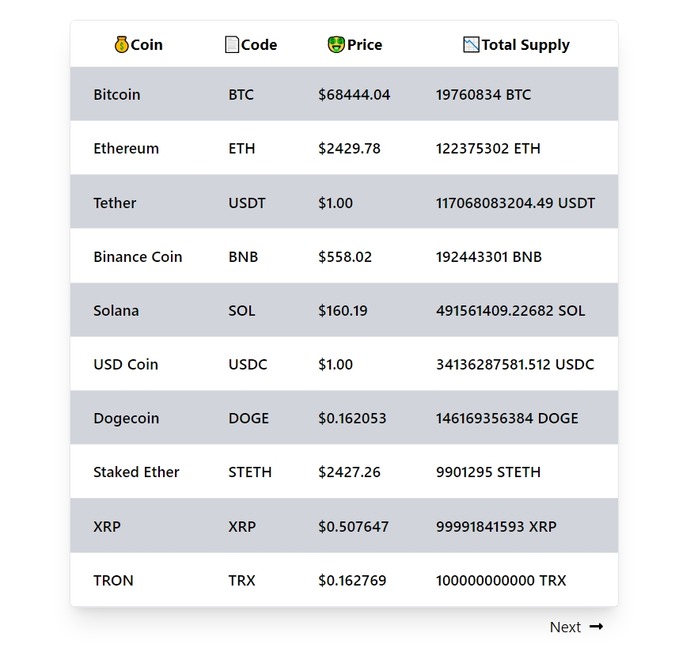

# Norebase Challenge - CoinLore API solution

## Welcome! 👋

Thanks for checking out my repository.

This is a solution to the [Norebase Frontend Developer Test](https://docs.google.com/document/d/1nLXm-TuhhSP7FY90GPL-9Ce_lA15b1S0DsC4Zc7brSM/edit?tab=t.0).  

## Table of contents

- [Overview](#overview)
  - [The challenge](#the-challenge)
  - [Screenshot](#screenshot)
  - [Links](#links)
- [My process](#my-process)
  - [Built with](#built-with)
  - [What I learned](#what-i-learned)
  - [Continued development](#continued-development)
  - [Useful resources](#useful-resources)
- [Author](#author)
- [Acknowledgments](#acknowledgments)

## Overview

### The challenge

Using the CoinLore API, create a simple web app that displays information on cryptocurrency coin prices. You can find the CoinLore API documentation here: CoinLore API Docs.

- Use the /tickers endpoint to fetch a list of coin prices.
- Display the coins in a table.
    - The table should be paginated.
    - Each page should display only ten (10) items.
    - The video linked below shows how the table should look and behave.

### Screenshot

### Links

- Solution URL: (https://github.com/glamorous-chi/norebase)
- Live Site URL: (https://norebase-mocha.vercel.app/)

### Built with

- React
- Tailwind CSS

### What I learned

I learned how to display fetched data in a table, I also ensured that the layout of the design on desktop and mobile devices matches the design shown in the sample video given.

### Continued development

I will love to add more features, and components to the design in the future.

### Useful resources

- [CoinLore API docs](https://www.coinlore.com/cryptocurrency-data-api)
- [Sample video](https://www.loom.com/share/a1ea440504f546118e35377eb84237fb?sid=47251424-6148-4770-b2e5-c3306fa78908)

## Author

- GitHub - (https://github.com/glamorous-chi)

## Acknowledgments

Thank you Norebase for this challenge!
